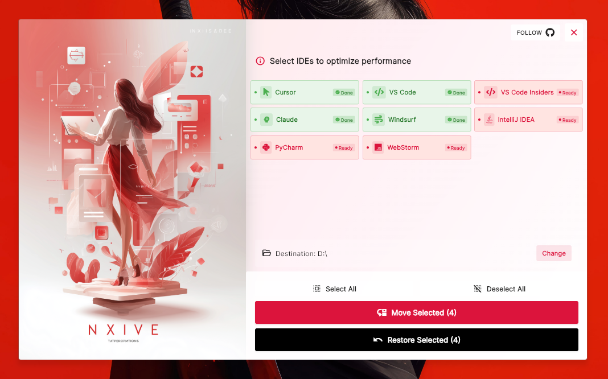
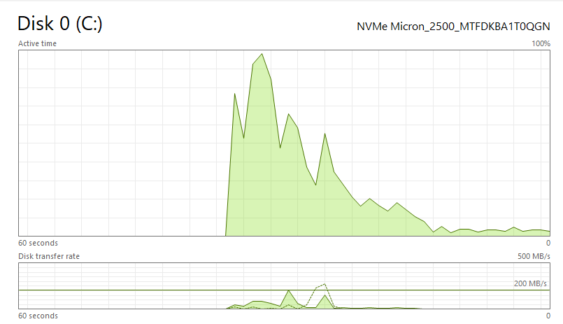
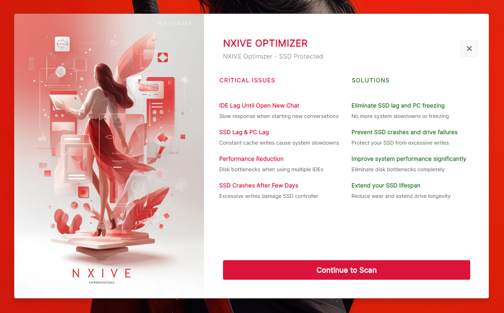
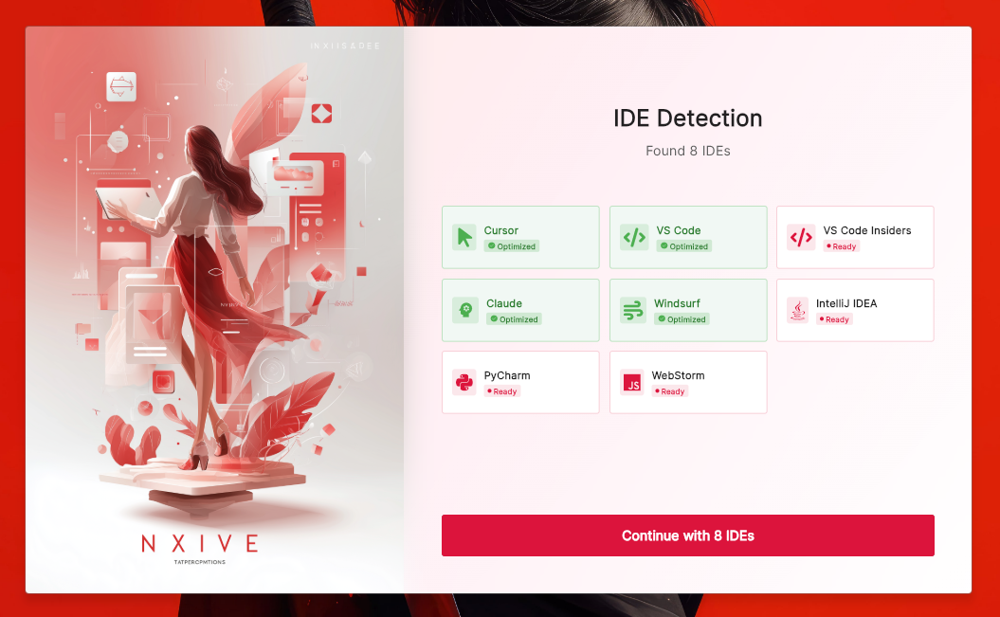
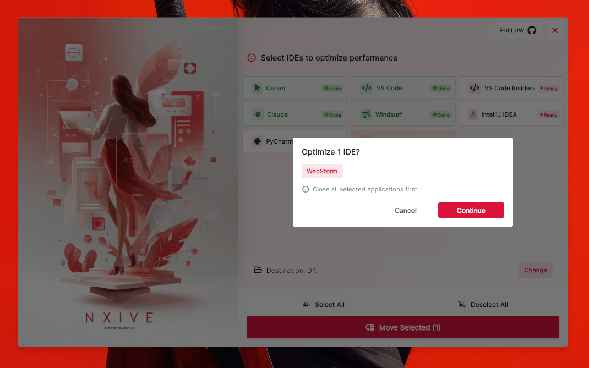

# NXIVE Optimizer

A professional desktop application built with Flutter that optimizes your development environment by relocating IDE cache folders from your primary SSD to a secondary drive. This helps reduce SSD wear, improve system performance, and prevent potential drive failures.



## Issues You May Face



After working in your IDE for a few hours, your PC can gradually start to feel slow or even briefly unresponsive. When you open Task Manager to investigate, you often see your primary drive showing very high active time in the graph, which matches the slow responses, delayed clicks and overall system slowdown. When this situation repeats often and your SSD or HDD is constantly under heavy read and write activity, it can shorten the lifetime of the drive and increase the risk of future failures. **Repeated spikes like this put your storage device at genuine risk of premature damage.**

## Overview

NXIVE Optimizer addresses critical SSD performance issues faced by developers using multiple AI-powered IDEs. It intelligently manages heavy development data so your tools continue working normally while significantly reducing the load on your primary SSD.

## Key Benefits

- **Reduce SSD Wear**: Minimize constant write operations on your primary drive
- **Improve Performance**: Eliminate system lag caused by multiple IDE cache operations
- **Prevent Crashes**: Reduce the risk of SSD failures due to excessive writes
- **Free Up Space**: Reclaim 5-15+ GB on your C: drive
- **Zero Downtime**: Applications continue working seamlessly after optimization

## Features

- Modern, clean user interface with Material Design 3
- Automatic IDE detection from AppData\Roaming
- Support for 24+ AI-powered IDEs and development tools
- Real-time status tracking (optimized/unoptimized)
- Custom destination path selection
- Junction point detection to prevent duplicate operations
- Safe restore functionality to revert changes
- Progress indicators and status updates
- Confirmation dialogs for critical operations

## Screenshots

<table>
  <tr>
    <td align="center">
      
      <br/>
      <strong>Welcome Screen</strong>
    </td>
    <td align="center">
      
      <br/>
      <strong>Scan Screen</strong>
    </td>
  </tr>
  <tr>
    <td align="center">
      
      <br/>
      <strong>Home Screen</strong>
    </td>
    <td align="center">
      
      <br/>
      <strong>Optimization Process</strong>
    </td>
  </tr>
</table>

## Supported IDEs

The application supports the following development environments:

**AI-Powered Editors:**
- Cursor
- Claude
- Windsurf
- Zed
- Trae
- Wrap
- Qader
- Replit
- Project IDX
- Continue
- Aider

**Traditional IDEs:**
- Visual Studio Code
- Visual Studio Code Insiders
- IntelliJ IDEA
- PyCharm
- WebStorm
- Eclipse Theia

**AI Coding Assistants:**
- GitHub Copilot
- Tabnine
- Codeium
- Codeium Chat

## Prerequisites

- Windows 10 or Windows 11
- Flutter SDK (latest stable version)
- Visual Studio 2019 or later with "Desktop development with C++" workload
- Administrator privileges (for file operations)

## Installation

### Building from Source

1. **Enable Windows desktop support:**
   ```bash
   flutter config --enable-windows-desktop
   ```

2. **Clone the repository:**
   ```bash
   git clone <repository-url>
   cd nxive-ide-optimizer
   ```

3. **Install dependencies:**
   ```bash
   flutter pub get
   ```

4. **Run the application:**
   ```bash
   flutter run -d windows
   ```

### Building Release Executable

```bash
flutter build windows --release
```

The executable will be located at:
```
build\windows\x64\runner\Release\NXIVE_Optimizer.exe
```

## How It Works

1. **Welcome Screen**: Introduces the application and explains the benefits
2. **Scan Screen**: Automatically detects installed IDEs from `%APPDATA%\Roaming`
3. **Home Screen**: Displays detected IDEs with their optimization status
4. **Destination Selection**: Choose any drive and folder for cache relocation
5. **Optimization**: Uses Windows `robocopy` to move files and `mklink` to create junction points
6. **Verification**: Automatically detects junction points to show optimization status

### Technical Implementation

- Uses Windows junction points (symlinks) to maintain application compatibility
- Native C++ platform channels for secure file operations
- Automatic `AppData\Roaming` folder structure creation in destination
- Junction detection prevents duplicate moves
- Safe restore process that moves files back and removes junctions

## Usage

1. **Launch the application** - The welcome screen will appear first
2. **Review the introduction** - Understand the benefits and critical issues addressed
3. **Scan for IDEs** - The app automatically detects installed development tools
4. **Select destination** - Choose your preferred drive and folder for cache storage
5. **Select IDEs** - Choose which IDEs you want to optimize
6. **Optimize** - Click "Move Selected" and confirm the operation
7. **Verify** - Check the status indicators to confirm successful optimization

### Important Notes

- **Close all selected applications** before moving their cache folders
- The application requires administrator privileges for file operations
- Junction points ensure your IDEs continue working normally after optimization
- You can restore any IDE to its original location using the "Restore Selected" button

## Project Structure

```
nxive-ide-optimizer/
├── lib/
│   ├── main.dart                    # Application entry point
│   ├── models/
│   │   └── ide_model.dart          # IDE data model
│   ├── screens/
│   │   ├── welcome_screen.dart     # Welcome/intro screen
│   │   ├── scan_screen.dart        # IDE detection screen
│   │   └── home_screen.dart        # Main application screen
│   └── services/
│       ├── file_operation_service.dart  # File operations service
│       ├── ide_service.dart            # IDE management service
│       ├── path_service.dart          # Path persistence service
│       └── window_service.dart        # Window control service
└── windows/
    └── runner/
        ├── file_ops_handler.h       # Platform channel header
        ├── file_ops_handler.cpp     # Platform channel implementation
        └── resources/
            └── app_icon.ico         # Application icon
```

## Technical Details

- **Framework**: Flutter 3.35.7+
- **Language**: Dart 3.9.2+
- **UI Framework**: Material Design 3
- **Font**: Inter (via Google Fonts)
- **Platform Channels**: Windows native C++ code for file operations
- **File Operations**: Windows `robocopy` and `mklink` commands
- **State Management**: Flutter StatefulWidget
- **Persistence**: SharedPreferences for user settings

## Safety Features

- Junction point detection prevents duplicate operations
- Confirmation dialogs for all critical operations
- Safe restore functionality to revert changes
- Automatic folder structure creation
- Error handling and user feedback

## Troubleshooting

**Issue**: Application cannot detect IDEs
- **Solution**: Ensure IDEs are installed in the default `%APPDATA%\Roaming` location

**Issue**: Move operation fails
- **Solution**: Close all instances of the selected IDEs and try again with administrator privileges

**Issue**: Junction point already exists
- **Solution**: Use the "Restore Selected" feature first, then move again

## License

This project is for personal use.

## Contributing

Contributions are welcome. Please ensure your code follows the existing style and includes appropriate error handling.

## Support

For issues, questions, or contributions, please refer to the project repository.

---

**NXIVE Optimizer** - Protect your SSD, optimize your workflow.
